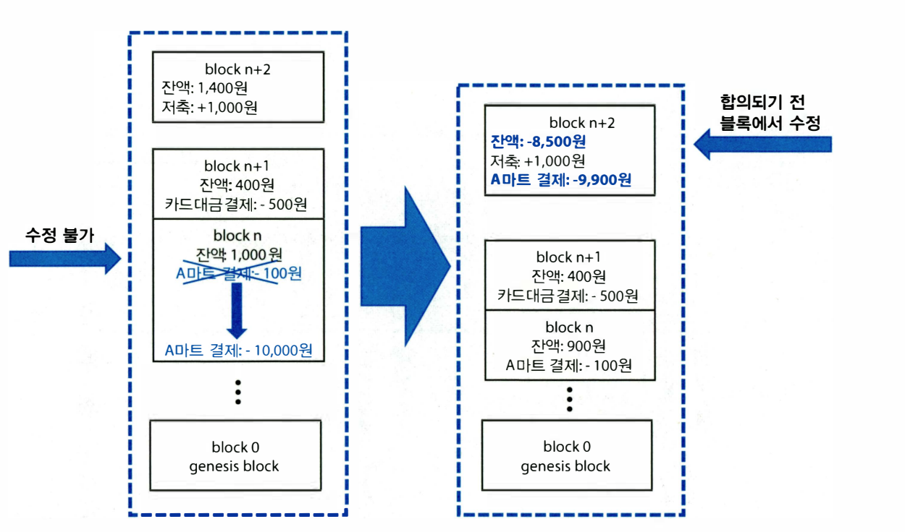

# 하이퍼레저 개념정리

Tags: 개념정리,블록체인,졸업과제,하이퍼레저

## 1. 하이퍼레저 패브릭 구성요소

- Peer
    - 블록체인을 구성하는 네트워크 노드 중 하나
    - **분산원장**과 **체인코드(스마트 컨트랙트)**를 관리하는 역할
    - **분산원장과 체인코드는 peer에 저장되고 설치**, 따라서 참여자는 **peer를 통해서만** 분산원장과 체인코드에 접근 할 수 있다.
    - 필요에 따라 peer는 복수 개의 분산원장과 체인코드를 가질 수있다.
    - 공식 문서에서는 하나의 peer에서 최소 한 개 이상의 분산원장과 체인코드 호스팅을 권장
- Chaincode
    - **분산원장에 데이터를 기록하거나 읽기 위해서 체인코드가 필요**, 주로 DApp과 함께 개발되어 사용
    - 예제

        

        

    - 시스템 체인코드
        - App 레벨에서 원장에 접근하는 일반적인 체인코드와 달리 하이퍼 레저 시스템 레벨에서 수행되는 체인코드로 기본적으로 제공하는 체인코드이다. 아래와 같이 다섯 종류의 체인코드가 있다.
            - QSCC(Quey System) : 블록체인의 저장된 데이터를 읽어 올때 사용
            - ESCC(Endorsement System) : 보증 정책을 담당하는 체인코드
            - VSCC(Validation System) : 블록 검증시에 사용되는 체인코드
            - CSCC(Configuration System) : 체인 설정 시 사용되는 체인코드, 블록에 대한 정보를 읽거나 수정, peer를 채널에 참여시키는 기능을 제공
            - LSCC(Lifecycle System) : 체인코드의 설치부터 인스턴스화까지 모든 과정을 수행
        - **QSCC, CSCC, LSCC**는 **사용자에 의해 CLI 명령어로 실행** 될 수 있고, **ESCC, VSCC**는 **Endorsing peer**(트랜잭션의 보증을 담당하는 peer)와 **Commiting peer**(블록에 대한 검증을 담당하는 peer)에 의해 실행
- DApp
    - 사용자가 분산 환경에서 비즈니스 거래 등을 편리하게 해 주기 위해 사용되는 APP
    - 하이퍼레저 패브릭에서는 DApp 개발을 위해 다양한 종류의 SDK를 제공
    - 개발자는 SDK를 통해서 트랜잭션을 생성하고 체인코드 함수를 불러오는 등의 여러 기능을 더 쉽게 개발 할 수 있음
    - 동작과정
        - 읽기 작업은 5단계 과정, 쓰기 작업은 9단계의 과정을 거침
        - 쓰기 작업은 **peer 간 합의 과정**이 필요하기 때문에 모든 peer가 쓰기 과정에 참여해야 한다.
        - 분산원장에 데이터를 기록하기 위해서는 **보증 정책**을 충족 시켜야함
        - 읽기

            

            1. 사용자 A의 인증서를 이용해서 인증 과정을 통과한 후 peer1과 연결

             2. 정상적으로 연결되고 난 후 DApp은 peer1에 설치된 체인코드의 query 함수를 호출

             3. peer1은 요청받은 체인코드의 query함수를 실행하여 **자신의 로컬 저장소**에  저장되어 있는 분산원장의 데이터를 DApp에게 전달

        - 쓰기

            

            1. 앞의 4단계는 query 함수 대신 update 함수를 쓰는 것을 제외하고 읽기와 동일
            2. 5단계에서는 peer1이 트랜잭션 입력값에 대한 결과값과 보증 정책을 확인, 충족되면 peer1은 결괏값과 peer1의 디지털 인증서를 DApp에다 전달 ( 보증 정책에 따라 하나의 peer에게 허가를 받거나 여러 대의 peer로 부터 허가를 받는 경우가 생길 수도 있다.)
            3. DApp은 받은 트랜잭션 결괏값과 peer1의 디지털 인증서와 함께 트랜잭션을 **orderer 노드**로 전송, **orderer노드는 자신이 속한 네트워크에서 발생한 모든 트랜잭션을 수신하고 순서에 맞게 정렬하여 블록체인의 최신 블록을 생성, 이후 생성한 블록을 자신이 속한 네트워크 모든 peer에게 전달** (orderer는 트랜잭션 내용을 확인하고 검증하지는 않는다.)
            4. 최신 블록을 전달받은 모든 peer는 해당 블록에 포함된 모든 트랜잭션에 대한 결괏값과 인증서를 검증하는 작업을 수행, 문제가 없다면 자신의 로컬 저장소에 저장된 분산원장을 업데이트
            5. peer는 블록 업데이트 결과를 DApp에 알려주는 것으로 업데이트 완료
- Endorsement Policy
    - 보증정책은 트랜잭션을 생성하는 DApp과 peer 간에 작용
    - 트랜잭션이 블록에 포함되기 위해서는 보증 정책에 지정된 peer의 허가를 받아야 한다.
    - 다음은 보증정책의 예이다

        

- Channel
    - peer 간의 통신은 채널을 통해서만 이루어진다.
    - 각 채널마다 하나씩 분산원장이 존재, 하이퍼레저는 채널에 참여한 조직의 구성원만이 해당 채널의 분산원장에 접근 할 수 있다.
    - 채널 생성은 CSCC를 호출하여 생성 할 수 있다.
    - 채널 생성 시 해당 채널에서 사용될 분산원장의 **genesis block**이 생성, genesis block에는 채널의 구성원, 채널 정책, 각 peer의 역할 등과 같은 설정이 포함되어 있다.
- Ledger
    - 분산원장은 현재 상태를 나타내는 **World State**, 원장의 생성 시점부터 현재까지의 사용 기록을 저장하는 **BlockChain** 두가지로 구분 할 수 있다.
    - World state는 데이터베이스 형태로 블록체인과 분리되어 구축되어 있다. 이러한 구조는 다음과 같은 특징을 가진다.
        - World state에 저장된 데이터는 **체인코드를 통해 조회/변경/삭제가 가능**
        - 합의에 의해 결정된 블록 및 블록 체인은 절대 수정 할 수 없다.
        - **World state**는 데이터의 기록, 수정, 읽기 등이 빈번하게 발생하기 때문에 **데이터베이스**로 구축되어 있다. 반면 **블록체인**은 데이터 요청이 거의 없고 append-only 방식의 저장이 목적이기때문에 **파일 시스템 형태로 저장**되어 있다.
    - 합의가 완료된 블록의 데이터는 잘못된 데이터라 하더라도 수정이 불가능하다. 수정을 위해서는 World State에서 데이터를 적절하게 수정하여 값을 올바르게 맞춰주어야 한다.

        

        - World State는 **key-value** 저장 방식을 사용하는 LevelDB와 JSON 포맷의 저장 방식을 사용하는 CouchDB중 하나를 선택
        - 사용자가 World state에 접근하기 위해서는 가장 가까운 peer에게 key를 넘겨주어 데이터를 요청한다.
        - peer는 World state에 트랜잭션을 업데이트하기 전 트랜잭션과 **World state의 version 값을 비교하는 작업을 수행, 둘의 값이 같아야만 업데이트 되고 다르다면 업데이트 되지 않는다.**
        - 정해진 용량만큼 또는 일정 시간 동안 발생한 트랜잭션은 하나의 블록이 된다. 블록체인은 생성된 블록들이 합의 과정을 마친 후 암호학적 기법을 통해 생성된 순서대로 연결되어 저장되는 데이터를 말한다.
        - 블록 체인 구조

            

            

            - Block number : 0부터 시작하여 합의 과정에 의해 블록이 생성될 때 마다 숫자가 1씩 증가
            - Current block hash : 현재 블록에 포함되어 있는 트랜잭션의 해시값
            - Previous block hash : 이전 블록에 대한 해시값

            

            - Data에는 해당 블록에 포함된 트랜잭션이 순서대로 저장되어 있다.
                - Header : 트랜잭션 version 정보와 트랜잭션이 실행되는 체인코드의 이름등이 명시되어 있다.
                - Signature : 트랜잭션 생성자의 디지털 인증서 정보가 들어있다.
                - Proposal : 체인코드에 들어가는 트랜잭션의 입력값이 저장되어 있음, 이 입력값을 이용해 체인코드를 실행시킨다.
                - Response : 트랜잭션 처리 결과값을 Read/Write set 형태로 반환하는 필드, Read는 트랜잭션의 proposal이 반영되기 전 값, write는 반영 된 후의 값을 의미, 이 값은 추후 최신 블록 검증 과정에 사용된다.
                    - 예시

                        

                - Metadata에는 블록 생성자 정보, 블록에 포함되어 있는 트랜잭션 보증 여부등이 포함

    - Gossip Protocol
        - 같은 채널 내에 있는 peer들 사이의 프로토콜
        - peer는 끊임없이 브로드캐스트 메시지를 생성하여 동일한 채널에 있는 peer의 상태를 확인
            - peer가 특정 시간 동안 메시지에 대한 응답을 못할 경우, 문제가 발생한 것으로 간주하고 해당 peer는 네트워크에서 오프라인 상태로 인식
        - peer는 같은 채널 내 peer들을 **랜덤하게 선택**하여 분산원장을 전송, 수신한 peer는 자신의 원장과 비교하여 최신 정보가 있으면 해당 내용을 업데이트
        - peer는 orderer로부터 분산원장을 업데이트 할 수 있는데, 조직의 모든 peer가 orderer에게 요청을 하면 과부화될 가능성이 있게 된다. 따라서 Leader peer를 대표로 선출하여 orderer와 통신 하게 된다.
        - Leader peer는 수동 혹은 자동으로 선출 될 수 있다. 수동으로 선출할 경우 조직당 Leader peer가 한 대 이상은 살아있도록 시스템 관리자가 수동으로 관리해야만 한다. 자동으로 선출할 경우 각 조직당 한 대의 Leader peer가 선출, 선출된 peer는 같은 조직의 peer에게 heartbeat 메시지를 주기적으로 보내어 살아있음을 증명한다.
        - Leader peer뿐만 아니라 모든 peer는 자신의 상태를 알리기 위해 heartbeat 메시지를 브로드 캐스트 한다.
- Identity
    - pdf 61부터 참고
- MSP
    - peer, orderer, Fabric-CA, Admin 등의 역할과 소속, 권한등을 정의 할 수 있다
    - local MSP
        - 네트워크 노드의 역할이나 권한을 부여할 때 사용
        - **하이퍼레저 패브릭의 모든 네으쿼드 노드는 하₩나 이상의 local MSP가 정의되어 있어야 한다.**
    - channel MSP
        - 채널 구성원들에 대한 멤버십 정의와 권한을 부여할 때 사용
        - 어떠한 조직에서 채널에 참여하려 할 때 채널 구성원은 channel MSP를 참고하여 보증 또는 거절을 하게 된다.

            

        - MSP 구조
            - Root CA
            - Intermediate CA : ICA 디지털 인증서

                

            - Organizational Units(OU) : ICA를 사용하지 않고 하나의 CA를 이용해서 조직을 세분화하고 싶을 때 사용
            - Administratiors : 조직 운영자의 인증서, 조직당 하나 이상의 운영자 인증서가 존재해야 한다.
            - Revoked Certificate : 페기된 인증서 관리, CRL 검사 시 해당 폴더를 참고
            - Node Identity : 개인키로 암호화한 인증서를 나타냄
            - Keystore : 개인키
            - TLS Root CA : 보안강화를 위해 TLS 기능을 사용할 때 Root CA로 부터 발급 받은 TLS인증서, TLS 통신은 주로 peer와 orderer사이에 사용
            - TLS Intermediate CA : ICA로부터 발급 받은 TLS 인증서

- Orderer
    - orderer에 의해 peer들은 아래 3단계 과정을 통해 동일한 최신 블록을 서로 공유 할 수 있다.
        1. **트랜잭션 제출**
            - DApp이 Endorsing peer들에게 트랜잭션을 제출
            - Endorsing peer가 Proposal 값을 바탕으로 체인코드를 시뮬레이션
            - 올바른 결과 값이 나온다면 자신의 Identity를 이용해 서명한 **디지털 인증서와 Read/Write set**을 함께 DApp에 전송
        2. **블록 패키징**
            - 제출한 트랜잭션을 orderer가 수집하여 순서대로 정렬한 후 최신 블록을 생성하는 과정
            - DApp이 peer로 부터 받은 인증서와 Read/Write Set을 트랜잭션과 함께 orderer로 전송
            - orderer는 순서대로 정렬 후 최신 블록생성

        3. **검증**
            - orderer가 생성한 최신 블록을 각 조직의 Leader peer에게 전달
            - Leader peer는 받은 블록을 자신이 속한 채널의 peer들에게 배포
            - 블록을 받은 peer들은 블록에 포함된 결과값이 정상적인지, 보증 정책에 부합하는지 등의 검증 작업을 수행한 후, 문제가 없을 시 자신의 로컬 저장소에 블록추가 후 World state 데이터에비으스를 업데이트