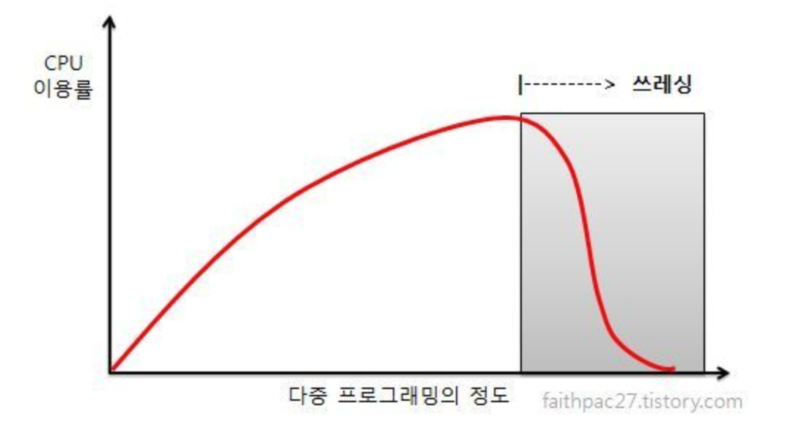

# 가상 메모리

### 배경

​	프로그램에는 오류 처리, 사용되지 않는 옵션 등 자주 사용되지 않는 기능들을 포함하고 있다. 또한 배열이나 테이블등이 필요 이상으로 많은 공간을 점유하고 있을 수 있다. 이와 같이 실행되지 않는 부분을 제외하고, 필요한 부분만 메모리에 올려놓고 실행 한다면 다음과 같은 장점이 있다.

- 프로그램이 물리 메모리 크기에 제약을 받지 않게 됨으로, 프로그래밍 작업이 간단해진다.
- 프로그램이 더 작은 메모리를 차지하므로, 동시에 더 많은 프로그램을 수행 할 수 있다. 이 때문에 응답시간이 증가하지 않으면서도 CPU 이용률 , 처리율이 높아진다.
- 프로그램을 메모리에 올리고 swap의 비용이 줄어들기에 프로그램이 보다 빨리 실행 된다.

  이 밖에도 가상 메모리는 페이지 공유를 통해 파일이나 메모리가 둘 또는 그  이상의 프로세스들에 의해 **공유되는 것을 가능하 게 한다.** 이렇게 되면 시스템 라이브러리가 여러 프로세스들에게 공유 될 수 있다. 일반적으로 라이브러리는 읽기만이 허용되는 상태로 주소 공간에 맵핑된다. 또한 페이지는 fork() 시스템 콜을 통해 프로세스 생성 과정 중에 공유 될 수 있기때문에 프로세스 생성 속도를 높일 수 있다.

### Demand Paging

   전체 프로세스를 읽어오지 않고 **lazy swapper**를 사용하여, 필요한 것들만 load한다. 이렇게 하기 위해서는 어느 페이지가 디스크에만 있고, 어느 페이지가 메모리에 올라와 있는지 구별 할 수 있어야 한다. 이를 위해 **valid-invalid 기법**이 사용 될 수 있다.  메모리에 올라오는 페이지에 대해서는 유효로 설정하고 메모리에 올라와 있지 않은 페이지의 페이지 테이블 항목은 무효로 설정하거나 페이지가 저장되어 잇는 디스크 주소를 기록해둔다. 이 때 프로세스가 **메모리에 올라와 있지 않는 페이지에 접근하고자 하며 page fault trap 발생한다.** 페이지 폴트를 처리하는 과정은 아래와 같다

1. 프로세스에 대한 내부 테이블을 검사해서, 메모리 참조가 vaild인지 invalid인지 알아 낸다.
2. 무효한 페이지에 대한 참조라면 프로세스는 중단되고, 유효한 참조이나 메모리에 올라오지 않았다면 디스크로부터 가져온다.
3. free frame을 찾는다.
4. 찾은 free frame으로 해당 페이지를 읽어 들이도록 요청한다.
5. 디스크 읽기가 끝나면, 페이지가 메모리에 올라왔다는 것을 알리기 위해 페이지 테이블을 갱신하고 프로세스 내부 테이블을 수정한다.
6. 트랩에 의해 중단되었던 명령어를 다시 수행

> demand paging이 만족할 만한 성능이 나올 수 있는 이유중 하나는 참조의 지역성때문이다.

### 

### Page Replacement

페이지 교체는 아래와 같은 과정을 거친다.

1. 디스크에서 필요한 페이지의 위치를 찾는다.

2. 빈 페이지 프레임을 찾는다.

   a. 빈 프레임 있다면 그것을 사용한다.

   b. 없다면 victim 프레임을 선정하기 위하여 페이지 교체 알고리즘을 가동한다.

   c. 희생 될 페이지를 디스크에 기록하고, 관련 테이블을 수정한다.

3. 빼앗은 프레임에 새 페이지를 읽어오고 테이블을 수정한다.
4. 페이지 폴트가 발생한 지점에서부터 사용자 프로세스를 계속한다.

만약 빈 프레임이 없는 경우에는 프레임을 비우기 위해 한번, 읽어들이기 위해 한번 총 두번 접근해야한다. 이러한 오버헤드는 dirty bit를 사용해서 감소 시킬 수 있다. 희생시킬 페이지가 선정되면 변경 비트를 확인하고 설정되어 있을 때만 현재 내용을 디스크에 기록한다. 

요구 페이징 시스템에서 중요한 두가지 문제는 **프레임 할당 알고리즘과 페이지 교체 알고리즘**이다.  페이지 교체 알고리즘의 성능은 특정 메모리 참조 나열에 대해 알고리즘을 적용하여 페이지 부재 발생 회수를 계산하여 평가한다. 이러한 메모리 주소의 나열을 참조열(reference string)이라고 부른다. 프레임의 수가 증가함에 따라 페이지 부재 수는 어떤 최솟값으로 떨어진다. 

페이지 교체 알고리즘의 종류는 아래와 같다.

`FIFO` : 메모리에 올라온 지 가장 오래된 페이지를 내 쫓는다. 큐를 이용하거나 페이지가 올라온 시간을 기록해도 된다. Balady의 모순 ( 더 많은 프레임을 주었음에도 오히려 페이지 폴트가 증가하는 현상)이 발생 할 수 있다.

`OPT` : 앞으로 가장 오랫동안 사용되지 않을 페이지를 찾아 교체, 실제 구현이 거의 불가능, 주로 비교 연구 목적을 위해 사용

`LRU` : 가장 오랜 기간 동안 사용되지 않은 페이지를 교체, 아래와 같이 두가지 구현 방법이 있다.

 - Counters 

   각 페이지 항목마다 사용 시간 필드를 넣고, CPU에 논리적인 시계나 카운터를 추가. 페이지에 대한 참조가 일어날 때 마다 페이지의 사용 시간 필드에 시간 제리즈터의 내용을 복사하여 각 페이지의 마지막 참조 시간을 유지한다. 이 기법에서는 페이지를 찾기 위해 페이지 테이블을 탐색해야 하고, 매 메모리 참조마다 메모리 쓰기 작업이 필요, CPU 스케쥴링에 의해 페이지 테이블이 변경 될 때마다 시간 값을 관리해야하며 시간 값의 overflow도 고려해야 한다.

 - Stack 

   페이지가 참조될 때 마다 페이지 번호는 스택 중간에서 제거되어 top으로 간다. 이렇게 되면 스택의 가장 밑 부분은 가장 오랫동안 이용되지 않은 페이지가 된다. 스택의 중간에서 제거가 일어남으로 스택은 보통 doubly linked list로 구현된다.

둘의 LRU 구현 방법 모두 반드시 TLB 레지스터 이상의 하드웨어 지원이 있어야 한다. 카운터 값과 스택을 갱신하는 일을 메모리 참조 때마다 수행되어여 하기 때문이다. 때문에 메모리 관리 오버헤드가 상당하고, 이를 감당 할 수 있는 시스템이 거의 없어 많은 시스템에서는 아래와 같은 LRU 근사 페이지 교체 알고리즘을 사용한다.

`LRU 근사 페이지 교체` :  페이지 참조가 있을 때마다 하드웨어가 참조비트를 설정한다. 참조비트는 페이지 테이블에 있는 각 항목과 대응된다.  이러한 참조비트를 구현하는 방법들은 아래와 같다.

- 부가적 참조 비트 알고리즘

  일정한 간격마다 참조 비트들을 기록함으로서 추가적인 선후 관계 정보를 얻을 수 있다. 각 페이지에 대해 8비트의 참조 비트를 할당하고 일정한 시간 간격마다 타이머 인터럽트를 걸어 오른쪽으로 쉬프트 시킨다. 이 비트를 정수로 생각하여, 가장 작은 수를 교체한다.

- 2차 기회 알고리즘

  기본 알고리즘은 FIFO이며, 페이지가 선택 될 때마다 참조 비트를 확인한다. 참조 비트가 0이면 페이지를 교체하고 1이면 다시 한번 기회를 주고 다음 FIFO 페이지로 넘어간다. 기회를 받은 참조비트는 0으로 해제되고 도착 시간이 현재시간으로 재설 정된다. 구현 방법은 순환 큐를 이용, 참조비트에 변경비티를 더해 개선된 2차 기회 알고리즘을 사용 할 수 있다.

`MFU` : 가장 작은 참조 회수를 가진 페이지가 가장 최근에 참조 된것이고 앞으로 사용될 것이라 판단

### Frame 할당

각 프로세스에 할당되는 프레임 수가 줄어들면 페이지 부재율이 증가하고, 프로세스 실행이 늦어지게 된다. 프로세스당 필요한 최소 프레임 수는 명령어 집합 아키텍처에 의해 결정된다.

가장 쉬운 할당 방법은 모든 프로세스에게 똑같이 할당해주는 것이다. 똑같이 할당해주고 남은 프레임은 가용 프레임 버퍼 저장소로 사용한다. 이러한 방법을 **균등할당** 이라고 한다.

또 다른 대안은 각 프로세스 크기 비율에 맞추어 할당하는 비례 할당 방식이다. 이 두가지는 모두 프로세스의 우선순위를 반영하고 있지 않다. 이때는 우선순위에 따라 할당하는 방법을 사용 할 수도 있다.

> 프레임을 교체하는 범위에 따라 다른 프로세스에 속한 모든 프레임을 대상으로 하는 전역교체와, 자기에게만 할당된 프레임들 중에서만 희생자를 찾는 지역 교체가 있다. 일반적으로 전역교체가 지역교체보다 더 좋은 성능을 나타내 많이 사용한다.

### Thrshing

충분한 프레임을 할당 받지 못해 빈번한 페이지 폴트로 인한 페이징작업을 **Thrashing** 이라고 한다. 다중 프로그래밍 정도가 높아질 수록 CPU 이용률은 상승하다, 최대값에 도달 한 뒤에도 다중 프로그래밍 정도가 더 커진다면 스레싱이 일어나게 되고 급격하게 CPU 이용률이 떨어진다.

스레싱은 지역 교환 알고리즘이나 우선순위 교환 알고리즘을 사용하면 제한 할 수 있다. 지역교환 알고리즘 하에서는 한 프로세스가 스레싱을 유발하더라도 다른 프로세스로부터 프레임을 뺏어 올 수 없음으로 다른 프로세스는 스레싱으로부터 자유로울 수 있다. 단 스레싱이 시작되면 여러 프로세스가 대부분의 시간을 디스크 큐에서 보내게 됨으로 스레싱과 관련이 없던 프로세스도 디스크 입출력 시간이 엄청나게 걸리게 된다. 따라서 스레임을 방지하기 위해서는 각 프로세스가 필요로 하는 최소한의 프레임 개수를 보장하는 것이 중요한데 이를 지역성 모델에서 부터 시작한다.

### 작업집합 모델

시간에 따라 주로 참조하는 페이지를 계산하여 이 값을 통해 프레임을 할당하는 것이다. 각각의 시간에 Locality를 포함 할 수 있는 프레임을 할당해주면 적절하게 메모리와 CPU를 사용할 수 있다. 이것을 예측하기 위해 Working set이라는 것을 사용한다. working set은 과거에 어떤 페이지가 사용되어 왔는지를 가지고 있는 데이터로, 최근 얼마까지의 시간을 기준으로 할 것인가에 대한 값이 working set window이다.

### 페이지 크기

페이지 크기를 감소 시키면 페이지의 수를 증가시키고 이는 곧 페이지 테이블의 크기를 증가시킨다. 때문에 페이지 테이블 크기를 줄이기 위해서는 큰 페이지가 좋다. 반면에 할당해 준 메모리 사용 효율을 위해서는(내부 단편화를 최소화하기 위해서) 작은 페이지 크기가 좋다. 

디스크 시간의 관점에서는 페이지 크기가 큰 것이 좋다. 지연시간 및 탐색 시간이 전송시간보다 훨씬 큰 비중을 차지함으로 디스크 입출력 시간의 효율을 좋게 하기 위해서는 페이지가 크게 되는 것이 유리하다. 또한 페이지 부재횟수를 줄이기 위해서도 큰 페이지가 좋다. 그러나 작은 페이지 크기를 갖는 경우 지역성이 향샹되어 전체 입출력이 더 줄어든다.  즉 실제로 필요한 정보만을 선별하여 메모리로 가져오게 되어 정밀도가 좋아진다.

결론적으로는 내부단편화나 지역성 같은 요소를 생각하면 작은 페이지가, 이외에 나머지들(페이지 테이블 크기나 입출력 효율등)을 생각하면 페이지가 큰것이 좋다. 

> 시대적으로는 페이지 크기가 커져가는 추세이다.

