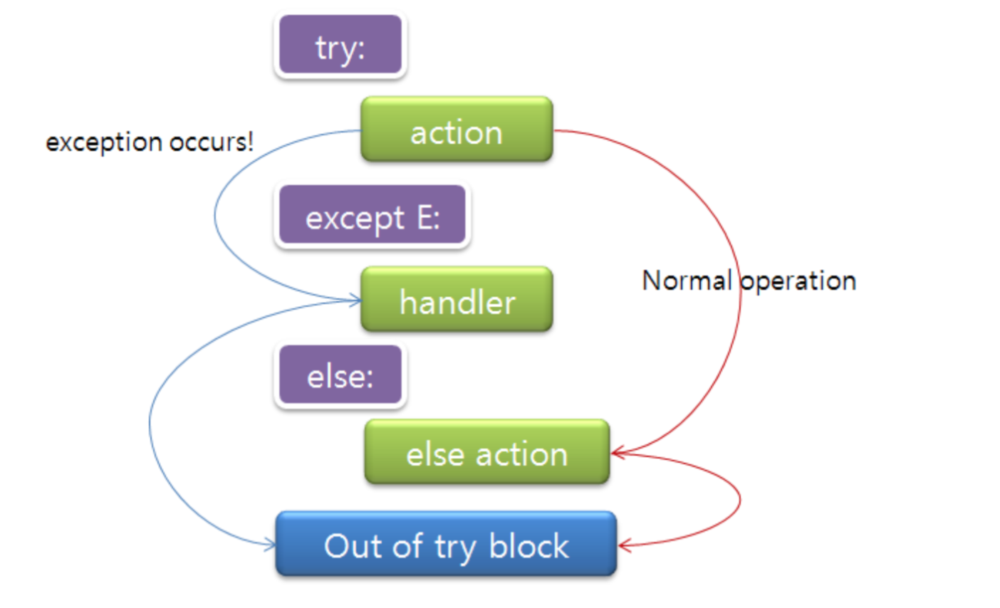

# Python Note Part 2

지난 인턴기간동안 Python 기반 DJango를 사용하면서 조금식 익혔던 파이썬 개념을 정리한 일기장이다. 내용의 두서가 없으니 필요한 부분만 빠르게 찾아보고 넘기도록하자.


### - 예외처리, try / except문 

- try / except문을 통해 컴파일러가 잡아주는 error를 제어 할 수 있다. error가 예상되는 코드를 try안에 넣고 except 뒤에 발생할 수 있는 에러의 이름을 적어두면, 에러 발생시 프로그램이 멈추지 않고 별도 처리가 가능하다. 또한 raise를 통해 직접 에러를 발생시킬 수 있다.

  

  ```python
  text = '100%'
  
  try :
      number = int(text) # 에러가 발생할 가능성이 있는 코드
  except ValueError :  # 에러 종류
      print('{}는 숫자가 아닙니다.'.format(text))  #에러가 발생 했을 경우 처리할 코드
      
  #------ 예외 이름을 모르는 경우 처리방법 ------------------------
  
  # 에러 이름 확인
  try:
      list = []
      print(list[0])  # 에러가 발생할 가능성이 있는 코드
  
  except Exception as ex: # 에러 종류
      print('에러가 발생 했습니다', ex) # ex는 발생한 에러의 이름을 받아오는 변수
      # 에러가 발생 했습니다 list index out of range
  
      
  #------ raise를 통해 직접 에러를 발생 ------------------------
  # 올바른 값을 넣지 않으면 에러를 발생시키고 적당한 문구를 표시한다.
  def rsp(mine, yours):
      allowed = ['가위','바위', '보']
      if mine not in allowed:
          raise ValueError
      if yours not in allowed:
          raise ValueError
  
  try:
      rsp('가위', '바')
  except ValueError:
      print('잘못된 값을 넣었습니다!')
  ```

  

### - time 모듈

- time 모듈을 통해 실행시간이 얼마나 걸렸는지를 확인 할 수 있다.

```python
import time

start_time = time.time()
#--------코드실행-----------
print("%s" %(time.time()- start_time))
```

​	

### - if __name__ == "__main__":

- 모듈을 실행할 수 있는 방법은 직접 실행하거나 임포트하거나 둘중 하나이다. 

  인터프리터에서 직접 실행하면,  `__name__`변수에   `"__main__"`가  들어가게 된다. 

- 아래는 어떤 사이트에 질문에 대한 답변이다.

  ​	스크립트가 파이썬 인터프리터 명령어로 패싱되어 실행되면(python myscript.py같이) 다른 언어들과는 다르게, 파이썬은 자동으로 실행되는 메인함수가 없습니다. 파이썬은 메인 함수가 없는 대신 들여쓰기 하지 않은 모든 코드(level 0코드)를 실행합니다 다만, 함수나 클래스는 정의되었지만, 실행되지는 않습니다

  질문하신 경우, 최 상위 코드는 if 블록이고, `__name__`은 현재 모듈의 이름을 담고있는 내장 변수입니다. python myscript.py 같이 이 모듈이 직접 실행되는 경우에만,`__name__ 은 "__main__"`으로 설정됩니다.

  따라서 질문자의 코드가 다른 모듈에 의해 import된 경우 함수와 객체의 정의는 import되지만 `__name__`이 `"__main__"`이 아니기 때문에 if문은 실행되지 않습니다.

### - `__init__.py`란?

- 해당 디렉토리가 패키지의 일부임을 알려주는 역할, 디렉터리에 이 파일이 없다면 패키지로 인식되지 않을 수 있다.
- 패키지 모듈로 추가할 때 from, imort를 사용 할 수 있게 해준다.


​	

### ModuleNotFoundError: No module named 'apt_pkg 

- 해결방법

  1. ```shell
     sudo apt-get install python3-apt --reinstall
     cd /usr/lib/python3/dist-packages
     cp apt_pkg.cpython-34m-i386-linux-gnu.so apt_pkg.so
     ```

  관련링크

  ​	<https://stackoverflow.com/questions/13708180/python-dev-installation-error-importerror-no-module-named-apt-pkg>


### ModuleNotFoundError: No module named 'pip'

- 가상환경이 python3.6 버전에서 적용되지 않고있다. 또한 pip3 모듈이 설치되어 있지 않다 아래와 같이 설치한다.

  ```shell
  wget https://bootstrap.pypa.io/get-pip.py # wget은 인터넷에 있는 파일을 다운 받는 명령어다
  sudo python3.6 get-pip.py
  python3.6 -m pip
  ```


### - 배열 순회 

- **iterator** : next() 함수를 갖는 파이썬 객체로 꼭 메모리에 올릴 데이터만 올려서 메모리를 효율적으로 이용할 수 있는 객체이다. list보다 상귀 객체이며, 아래 함수들이 iterator를 반환하는 것은 set과 같은 다른 자료구조로 유연하게 변환시킬 수 있도록 하기 위함이다.

- **map**

  - 배열 원소에 함수를 적용시켜 결과를 반환하고 싶을 때 사용

  ```python
  # 각 배열 원소를 제곱한 새로운 리스트를 만드는 코드
  items = [1, 2, 3, 4, 5]
  squard = list(map(lamda x: x**2, items)) # map함수는 iterator를 반환, 따라서 이를 list로 변경하여 사용해야 한다.
  ```

- **filter**

  - 배열 원소에 어떤 함수 조건의 일치하는 값만 반환하고 싶을 때 사용

  ```python
  # 리스트 중 음수만 골라내는 코드
  number_list = range(-5,5)
  less_than_zero = list(filter(lambda x: x<0 , number_list))
  ```

- **List Comprehension**

  - 원하는 구성 요소를 가지는 리스트를 쉽게 만들 수 있는 기능

  ```python
  # 길이가 1~10 인 정사각형 중에 길이가 짝수인 정사각형의 넓이 구하기
  areas = []
  for i in range(1,11):
      if i % 2 == 0:
          areas.extend([i*i])
  
  print('areas :', areas)  # [4, 16, 36, 64, 100]
  
  # list comprehension 방법
  areas2 = [i * i for i in range(1,11) if i % 2 ==0]
  print('areas2 :', areas2)  # [4, 16, 36, 64, 100]
  
  # for 문을 돌면서 i를 하나씩 가져오고,
  # if 조건에 맞는 i만 보낸다.
  # 조건에 맞는 i 를 원하는대로 계산해서 리스트에 넣는다.
  
  
  # 길이가 3*3 인 바둑판의 좌표 만들기
  [(x, y) for x in range(3) for y in range(3)]
  # [(0, 0), (0, 1), (0, 2), (1, 0), (1, 1), (1, 2), (2, 0), (2, 1), (2, 2)]
  ```

- **Dictionary Comprehension**

  ```python
  students = ['몽키', '선샤인', '시와', '톰']
  scores = [85, 92, 78, 100]
  
  score_dic = {
      students : score for students, score in zip(students, scores)
  }
  
  print(score_dic)
  # {'몽키': 85, '선샤인': 92, '시와': 78, '톰': 100}
  ```

  

### Log 파일 생성

```python
def makeLogFile(log_name, dir_name=False):
    if not dir_name:
        dir_name= datetime.datetime.today().strftime("%Y_%m_%d")
    log_dir = os.getcwd() + "/log/" + dir_name + "/"
    log_name = "missing_" + search_filter[YEAR_CONDITION] + ".log"

    if not os.path.isdir(log_dir):
        os.mkdir(log_dir)
        
    return log_dir+log_name
```


### 정렬

- 파이썬 리스트는 **sort()**라는 메소드를 통해 정렬 가능, 이 메소드는 리스트 자체를 정렬된 상태로 변경한다.

  ```python
  test_list = [4, 3, 2, 5, 1]
  test.sort()
  print(test_list)
  # [1, 2, 3, 4, 5]
  ```

- sorted() 내장함수는 이터러블 객체로부터 정렬된 리스트를 생성한다. 이 메소드는 기존의 리스트를 변경하는 것이 아니라 새로운 리스트를 반환한다. 또한 리스트 뿐아니라 다른 이터러블 객체에도 적용가능하다

  ```python
  students = [
          ('홍길동', 3.9, 2016303),
          ('김철수', 3.0, 2016302),
          ('최자영', 4.3, 2016301),
  ]
  sorted(students, key=lambda student: student[2])
  # [('최자영', 4.3, 2016301), ('김철수', 3.0, 2016302), ('홍길동', 3.9, 2016303)]
  ```

  람다식은 정렬을 하기전에 호출되는 함수로 student 요소를 받아러 student[2]를 반환, 즉 정렬의 기준이 학번이 된다. reverse 매개변수를 통해 내림차순으로 정렬 할 수 있다.

  ```python
  answerDict = sorted(answerDict.items(),key=lambda x: x[1], reverse=True) # 딕셔너리 내림차순 정렬, 튜플을 반환
  answer = list(( x for x,y in answerDict)) # 튜플을 리스트 형태로 변환
  ```

  