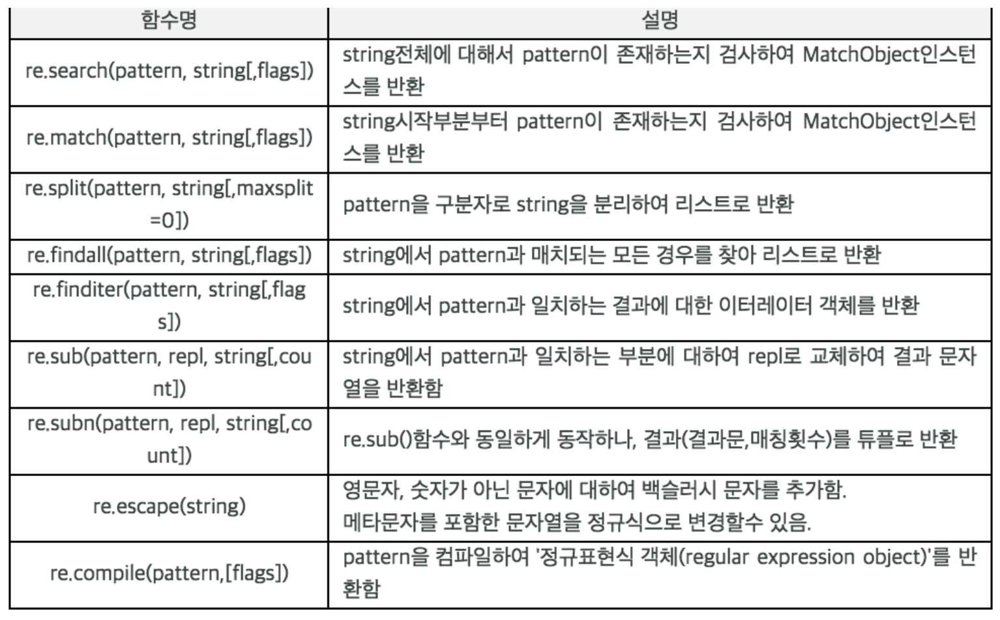

# Python 일기장 Part1

지난 인턴기간동안 Python 기반 DJango를 사용하면서 조금식 익혔던 파이썬 개념을 정리한 일기장이다. 내용의 두서가 없으니 필요한 부분만 빠르게 찾아보고 넘기도록하자.


#### - Parameter Call

- 파이썬은 모든 것이 객체, 객체에는 2가지 종류가 있다. 넘어온 인자 종류에 따라 두가지 방식으로 동작하는 call-by-assignment를 사용한다.
- Immutable object : scala tpye과 유사한 개념으로 int, float, str, tuple 등이 있다. 해당 객체가 파라미터로 넘어갈 경우 처음에는 call by reference로 받지만 내부에서 값이 변경될 경우 call by value로 동작한다. 
- Mutable object : list, dict, set 등 complex type과 유사하다. 파라미터로 넘어갈 경우 call by reference로 동작한다.
- python에서 객체들은 Reference Count라는 값을 가지고 있어, 자신을 가르키고 있는 변수의 숫자를 저장하고 있다.
- 변수는 메모리 공간에 값을 직접 지정하지 않으며, 해당 값의 인스턴스를 가르키고 해당 인스턴스의 Reference Count를 증가 시킨다
- 즉 연산 등을 통해 변수가 가지는 값이 변경되더라도 실제 메모리에 저장된 값이 변경되는 것이 아니라 가르키고 있는 인스터스가 변경된다.
- copy.cpoy(복사객체)를 통해 swallow copy를 수행 할 수 있다.

#### - Class

 - 파이썬은 클래스가 객체를 만드는데 사용하는 방법에서 더 나아가 **클래스 그 자체도 객체**

 - 파이썬 메서드의 첫번째 파라미터명은 관례적으로 self라는 이름을 사용

 - 호출시 호출한 객체 자신이 전달되기 때문에 self라는 이름을 사용

 - 파이썬 생성 순서

   ​	생성자로 객체생성을 호출받으면 먼저 __ new __ 를 호출하여 객체를 생성할당하고, 이 메소드가 __ init __ 메소드를 호출하여 초기화, 일반적으로 클래스를 만들 시 __ init __ 메소드만 오버라이딩하여 객체 초기화에 이용

- self._~에서 _ 의미는 내부적으로 사용되는 변수, 파이썬 기본 키워드와 충돌을 피하기 위한 변수라는 의미

- 파이썬은 기본적으로 접근제어자가 없고 모두 Public

- __ init __ 에서 객체의 불변석을 확립

  ```python
  class Flight:
  
      def __init__(self, number):
          if not number[:2].isalpha():
              raise ValueError("첫 두글자가 알파벳이 아닙니다.")
          if not number[:2].isupper():
              raise ValueError("첫 두글자가 대문자가 아닙니다.")
          if not number[2:].isdigit():
              raise ValueError("세번째 글자 이상이 양의 숫자가 아닙니다.")
          self._number = number
  ```

- private을 이용하고 싶으면 __를 변수명 앞에 붙여주면 됨

- **파이썬에서는 하나의 클래스 내부에서 메소드 명칭이 똑같고, 인자를 다르게 하는 메소드 오버로딩을 허용하지 않는다. 그저 덮어씌어질 뿐!**

- 클래스 속성은 **self.속성**에 할당하는 것이 아니라 class 안에서 바로 할당, self.속성에 할당했던 변수들은 모두 인스턴스 속성에 해당

  ```python
  class CustomClass:
      속성명 = 값
  
      def custom_method():
          pass
      ...
  ```

- **클래스 속성은 같은 클래스의 인스턴스들이 똑같이 값을 공유**

- 인스턴스와 클래스 모두 같은 속성이 있다면 인스턴스 속성을 먼저 찾음

- 상속은 자식 클래스를 선언할 때 소괄호로 부모클래스를 전달해주면 됨

- super() 키워드를 사용하여 자식 클래스 내에서 부모 클래스를 호출 할 수 있다.

- mro() : 상속관계를 확인 할 수 있는 메소드

- 클래스에서 직접 접근 할 수 잇는 메소드를 정적메소드라 함, **파이썬에서는 다른 언어와 다르게 정적메소드임에도 인스턴스에서도 접근이 가능**

   - classmethod : 첫번째 인자로 클래스를 입력
   - staicmethond: 특별히 추가되는 인자가 없음
  - 인스턴스 메소드는 첫번째 인자로 객체 자신 self 자신을 입력하여야 한다.

  ```python
  class CustomClass:
  
      # instance method
      def add_instance_method(self, a,b):
          return a + b
  
      # classmethod
      @classmethod
      def add_class_method(cls, a, b):
          return a + b
  
      # staticmethod
      @staticmethod
      def add_static_method(a, b):
          return a + b
  ```

  

  - static메소드는 부모클래스의 클래스속성값을 가져오지만, class메소드는 현재 클래스의 속성값을 가지고 온다 

    ```python
    class Language:
        default_language = "English"
    
        def __init__(self):
            self.show = '나의 언어는' + self.default_language
    
        @classmethod
        def class_my_language(cls):
            return cls()
    
        @staticmethod
        def static_my_language():
            return Language()
    
        def print_language(self):
            print(self.show)
    
    class KoreanLanguage(Language):
        default_language = "한국어"
        
        from language import *
     a = KoreanLanguage.static_my_language()
     b = KoreanLanguage.class_my_language()
    a.print_language()
    >> 나의 언어는English
    b.print_language()
    >>나의 언어는한국어
    ```

#### - Type Class 

 - 변수의 type을 체크할 뿐 아니라, 새로운 클래스를 생성 할 수 있음, type은 메소드가 아닌 클래스, 아래와 같은 파라미터를 가짐

   **tpye(클래스, 부모클래스, 속성값을 정의하는 심볼테이블)**

   ```python
   fruit = type("superclass",(),{})
   banana = type("myclass",(fruit,),{'name':'banana','value':'like'})
   print banana.name
   # 'banana'
   print banana.value
   # 'like'
   ```

   * tpye(class)는 type!

#### - Meta Class

- 클래스를 만드는 데 사용되는 것을 의미, 즉 클래스로 객체를 만들듯 메타클래스로 클래스를 만들 수 있다. 대표적인 예로 type 클래스가 있다

 - __ metaclass __ 를 클래스 내부에 선언한다면 해당 클래스를 생성하기 위해 __  metaclass __ 를 사용하게 된다. Python은 클래스 정의에  __ metaclass __ 가 있는지 먼저 확인, 발견 될 경우 클래스를 만들기 위해 해당 메타 클래스를 사용, 발견하지 못한다면 type을 사용해서 만듬, 단 metaclass는 상속되지 않는다.

 - 메타클래스의 주 목적은 클래스가 만들어질 때 클래스를 자동으로 바꾸기 위한 것, 보통 현재 컨텍스트와 알맞는 클래스를 만들기 위해 api 같은 곳에 커스텀 메타클래스를 사용, 클래스 생성 가로채기, 클래스 수정하기, 수정된 클래스 반환하기 등에 사용

   ```python
   # 메타클래스는 우리가 보통 `type`에 전달하는 객체와 같은 객체를 받습니다.
   def upper_attr(future_class_name, future_class_parents, future_class_attr):
     """
       대문자로 변환된 속성의 리스트와 함께 클래스 객체를 반환합니다.
     """
   
     # '__'로 시작하지 않는 모든 객체를 가져와 대문자로 변환합니다.
     uppercase_attr = {}
     for name, val in future_class_attr.items():
         if not name.startswith('__'):
             uppercase_attr[name.upper()] = val
         else:
             uppercase_attr[name] = val
   
     # `type`으로 클래스를 생성합니다.
     return type(future_class_name, future_class_parents, uppercase_attr)
   
   __metaclass__ = upper_attr # 이리하여 모듈 내에 있는 모든 클래스가 영향을 받게 됩니다.
   
   #--------Class 형 -----------------
   class UpperAttrMetaclass(type): 
   
       def __new__(cls, clsname, bases, dct):
   
           uppercase_attr = {}
           for name, val in dct.items():
               if not name.startswith('__'):
                   uppercase_attr[name.upper()] = val
               else:
                   uppercase_attr[name] = val
   
           return super(UpperAttrMetaclass, cls).__new__(cls, clsname, bases, uppercase_attr)
   
   
   class Foo(): # 하지만 글로벌 메타클래스는 object와 함께 작동하지 않습니다
     # 하지만 우리는 이 클래스에만 영향을 주고자 여기에 __metaclss__를 정의하면
     # object 자식(children)과 함께 작동하게 됩니다.
     bar = 'bip'
   
   print(hasattr(Foo, 'bar'))
   # Out: False
   print(hasattr(Foo, 'BAR'))
   # Out: True
   
   f = Foo()
   print(f.BAR)
   # Out: 'bip'
   ```


#### - Class Based View 

##### 	1. 글 목록 전체 표시(List)

  - FBV를 활용하여 글 목록 전체 표시

    ```python
    from django.shortcuts import render
    from .models import Question
    
    
    def index(request):
        latest_question_list = Question.objects.order_by('-pub_date')[:5] # 최근 5개의 질문 리스트만 가져온다.
        context = {'latest_question_list' : latest_question_list}
        return render(request, 'polls/index.html', context)
    ```

-  CBV - ListView를 활용하여 글 목록 전체 표시

  - 게시판의 글 목록 전체를 표시하거나, 특정 DB table의 record 전체(혹은 일부)를 List로 표시할 때 활용 할 수 있음
  - 리스트가 테이블의 모든 레코드인 경우 모델 클래스만 지정하면 됨

#### datetime 모듈

 - strftime : 시간을 문자열로 출력

   ```python
   import datetime
    
   now = datetime.datetime.now()
   print(now)          # 2018-07-28 12:11:32.669083
   
   nowDate = now.strftime('%Y-%m-%d')
   print(nowDate)      # 2018-07-28
    
   nowTime = now.strftime('%H:%M:%S')
   print(nowTime)      # 12:11:32
    
   nowDatetime = now.strftime('%Y-%m-%d %H:%M:%S')
   print(nowDatetime)  # 2018-07-28 12:11:32
   
   yesterday = datetime.datetime.today() -datetime.timedelta(1)
   ```

   

#### - 삼항연산자

```python
    special_filter = request.GET.get('add')if request.GET.get('add') is not None else ''
```


#### - Dictionary 

 - key값 확인 

   ```python
   if 'key1' in dict :
   ```

   **in**ㅋㅣ워드는 원래 dict에 키 유무를 위해 사용

 - 두개의 Dictionary 결합

   ```python
   dic1 = {1:10, 2:20}
   dic2 = {1:100, 3:300}
   dic1.update(dic2)
   print(dic1)
   # {1: 100, 2: 20, 3: 300}
   ```

- Dictionary 삭제

  ```python
  del dict[key]
  ```

- Dictionary 탐색

  ```python
  # key값이 할당된다. 순서는 임의적임으로 같은 순서를 보장할 수 없다.
  a = {'alice': [1, 2, 3], 'bob': 20, 'tony': 15, 'suzy': 30}
  for key in a:
  	print(key) # alice, bob ,tony ,suzy 출력
      
  # value값으로 for문을 반복하기 위해서는 values()를 사용
  for val in a.values():
      print(val) # value값들 출력
      
  # key와 value를 한꺼번에 for문을 반복할려면 items()를 사용
  for key,val in a.items():
      print(key)
      print(val)
  ```


### - Function

 - globals() : 파이썬 내장 함수로, 생성된 함수 객체들을 볼 수 있다.

 - 리턴형은 어떠한 객체든 돌려줄 수 있고, 여러개의 값을 튜플 단위로 묶어서 보낼 줄 수도 있다. 리턴형이 없는 경우 None을 반환

   ```python
   def f_RcvTuple():
   	return 10,20
   
   a,b = f_RcvTuple() # 10, 20
   ```

- 파이썬은 인자의 기본값을 설정 할 수 있다. 기본값이 설정된 인자는 값이 넘어오지 않았을 때 설정된 기본값으로 함수 내에서 사용된다, 기본값은 함수가 실행 될 때가 아닌, 정의된 함수가 처음 평가 될 때 값이 정해진다.

  ```python
  def function(a, b=value)
  ```

- 기본값을 mutable한 객체로 했을 때 주의가 필요, 값이 쌓이게 되는 문제가 있을 수 있다.  해결책은 기본값을 None으로 주고 None인 경우에만 값을 할당

  ```python
  def add_book(book_list=[]):
     book_list.append('파이썬 베이직')
     return book_list
  
  book_list=['Hello, Python', 'Head First Python']
  add_book(book_list) # ['Hello, Python', 'Head First Python', '파이썬 베이직']
  add_book() # ['파이썬 베이직']
  add_book() # ['파이썬 베이직', '파이썬 베이직']
  add_book() # ['파이썬 베이직', '파이썬 베이직', '파이썬 베이직']
  
  #Solution
   def add_book(book_list=None):
      if book_list is None:
          book_list =[]
       book_list.append('파이썬 베이직')
       return book_list
  ```

- keyword argument : 키워드 인자를 사용하여, 순서를 무시하고 입력 할 수 있음

  ```python
  def define_suwoni(msg, nick='천재'):
       print(""" 수워니는 어떤사람? - {msg}  수워니의 별명은?  - {nick}
   """.format(msg=msg,nick=nick))
          
  define_suwoni('키큰사람', '바보') # 위치인자
  define_suwoni(nick='바보', msg = '잠이 많은 사람') # 키워드 인자
  ```

- 위치 인자 Unpacking : 리스트나 튜플과 같이 index가 존재하는 객체를 *표시를 붙여 인자로서 함수에 입력하면 함수의 정의된 위치에 맞게 입력이 됨

  ```python
  def abc(a, b, c):
  	return b, a, c
  
  p = [5, 7, 9]
  abc(*p) # (7, 5, 9)
  abc(*(1,5,9)) #(5, 1, 9)
  
  # 입력 뿐 아니라 아래와 같이 함수 정의 때도 사용가능
  # 정의 할 때 언패킹을 이용하면, 인자를 받는 수에 제한이 없어진다.
  def abc(*args):
       return args[1], args[0], args[2]
  # 고정인자와 같이 사용가능, 단 언패킹할 인자는 반드시 뒤쪽에 위치하여야 함
  def abc(a, *args):
  	return args[0], a, args[1]
  abc(*(1,5,9)) # (5, 1, 9)
  ```

- 키워드 인자 Unpacking : 키와 값이 있는 dictionary타입의 변수에 ** 표시를 해서 대입,  그 외에는 위치인자 언팩킹과 동일

  ```python
  def air_line(**kwargs):
  	print('출발지는 : ', kwargs['departure'])
  	print('도착지는 : ', kwargs['arrival'])
  	print('비행시간은 : ', kwargs['flighttime'])
  
  myflight = {'departure':'서울', 'arrival':'LA', 'flighttime':'10시간'}
  air_line(**myflight)
  ```

  

### - Requests 모듈(HTTP 요청)

 1. 기본사용법

    ```python
    import requests 
    URL = 'http://www.tistory.com' 
    response = requests.get(URL) 
    response.status_code # 상태코드
    response.text # html문서
    
    #Get 요청시 data 전달법
    params = {'param1': 'value1', 'param2': 'value'} 
    res = requests.get(URL, params=params)
    
    #Post 요청시 data 전달법
    data = {'param1': 'value1', 'param2': 'value'} 
    res = requests.post(URL, data=data)
    
    #Header 또는 Cookie 추가
    headers = {'Content-Type': 'application/json; charset=utf-8'} cookies = {'session_id': 'sorryidontcare'} 
    res = requests.get(URL, headers=headers, cookies=cookies)
    
    #Respones 객체
    res.request # 내가 보낸 request 객체에 접근 가능 
    res.status_code # 응답 코드 
    res.raise_for_status() # 200 OK 코드가 아닌 경우 에러 발동 
    res.json() # json response일 경우 딕셔너리 타입으로 바로 변환
    
    ```


### - 정규표현식 re 모듈

 - 사용법

   ```python
   import re # 정규표현식 모듈 
    
   p = re.compile('[a-z]+') # re 내장모듈 내(.) compile 메서드를 사용. 
                            # compile 메서드는 "패턴 객체"를 반환한다. 
    
   m = p.match("python")    # 패턴 객체(p)에는 또다시 검색 메서드가 있다. 
   
   # search 와 match
   # search 는 처음이 일치하지 않더라도 전체를 수색, 반면 match는 처음이 일치하지 않으면 바로 None을 반환, 둘다 원하는 것이 발견되면 멈춘다는 공통점이 있다. 매칭되었다면 group 메소드로 확인 할 수 있다.
   source13 = "All That Is Gold Does Not Glitter"
   match = re.match("Not", source13) # no match
   search = re.search("Not", source13) # match
   print(match.group())
   print(search.group())
   
   # findall 과 finditer
   # 이 녀석들은 원하는 것이 발견되더라도 검색을 멈추지 않는다. 때문에 결과값을 list 또는 iterator값으로 반환한다.
   
   import re
   p = re.compile('[a-z]+')
   m = p.findall("Life is to short")
   print(m) # ['ife', 'is', 'to', 'short']
   print(type(m))  # <class 'list'>
   
   m = p.finditer("Life is to short")
   print(m) # <callable_iterator object at 0x7f010c08b588>
   print(type(m)) # <class 'callable_iterator'>
    
   ```

- 메소드 목록

  

- 그룹화

  - 정규표현식을 () 안에 넣으면 그 부분만 그룹화된다. groups 메서드를 통해 그룹들을 튜플 형태로 리턴, 0인덱스는 전체를 뜻한다.

  ```python
  p = re.search('(hello)(world)', 'helloworld') # 정규표현식 hello와 world의 매치 결과를 각각 그룹화하였다
  grouping = p.groups()
  
  p.group() # 인자를 넣지 않으면 전체 매치 결과 리턴
  #helloworld
  
  p.group(0) # group()와 같다
  #helloworld
  
  p.group(1) # 1번 그룹 매치 결과 리턴
  #hello
  
  p.group(2) # 2번 그룹 매치 결과 리턴
  #world
  ```


### - File 입출력 

 - 파일생성하고 출력값 쓰기

   ```python
   f = open("새파일.txt", 'w') # 쓰기모드, 읽기모드: r, 추가모드 : a(이어쓰기)
   f.write('Hello\n')
   f.close()
   ```

   

- with 구문 : 파일 close를 자동으로 해줌

  ```python
  with open("foo.txt", "w") as f:
      f.write("Life is too short, you need pythona
  ```

  

### - Urllib, URL 라이브러리

-  웹 문서 불러오기

  ```python
  import urllib.request
  
  req = urllib.request
  req.urlopen("https://kimdoky.github.io") # 해당 url에서 얻은 데이터에 대한 객체를 돌려준다.
  
  ```

- 웹 서버 정보 받아오기

  ```python
  d = req.urlopen("https://kimdoky.github.io")
  status = d.getheaders() # 서버에 대한 정보를 리스트로 반환, 운영체제나 날짜, 타입등 여러가지 정보를 알 수 있음
  for s in status:
  	print(s)
  #---------출력 결과--------------------
  ('Server', 'GitHub.com')
  ('Content-Type', 'text/html; charset=utf-8')
  ('Strict-Transport-Security', 'max-age=31557600')
  ('Last-Modified', 'Sun, 11 Jun 2017 17:05:29 GMT')
  ('Access-Control-Allow-Origin', '*')
  ('Expires', 'Mon, 12 Jun 2017 06:48:26 GMT')
  ('Cache-Control', 'max-age=600')
  ('X-GitHub-Request-Id', 'D688:078B:3674E2D:4493F9A:593E36E2')
  ('Content-Length', '18158')
  ('Accept-Ranges', 'bytes')
  ('Date', 'Mon, 12 Jun 2017 06:40:59 GMT')
  ('Via', '1.1 varnish')
  ('Age', '152')
  ('Connection', 'close')
  ('X-Served-By', 'cache-nrt6122-NRT')
  ('X-Cache', 'HIT')
  ('X-Cache-Hits', '1')
  ('X-Timer', 'S1497249659.109658,VS0,VE1')
  ('Vary', 'Accept-Encoding')
  ('X-Fastly-Request-ID', 'e7d21faf9dc1c9baf4f8c6ee11bba5bf187b0ebe')
  >>>
  ```

- 웹 페이지의 상태 확인하기

  ```python
  d = req.urlopen("https://kimdoky.github.io")
  d.status # 200
  ```

- 웹 페이지 데이터 읽어오기

  ```python
  d = req.urlopen("https://kimdoky.github.io")
  d.read() # html 문서코드를 출력
  ```

- urlib.parse 모듈 

  - url에 한글 검색어를 입력할 수 있도록 도와주는 모듈로 한글로검색하기 위해서는 인코딩 과정을 거쳐야하는데, 이때 인코딩을 해주는 모듈이다.

  ```python
  import urllib.parse
  
  def input_query():
  	q = str(input("검색어를 입력하세요: "))
  	return "&quuery=" + q
  
  #------ #은 콘솔창, ##은 함수 반환값-------------------
  input_query()  
  # 검색어를 입력하세요: 무한도전
  ##'&quuery=무한도전'
  def input_query2():
  	q = urllib.parse.quote_plus(str(input("검색어를 입력하세요: ")))
      # quote_plush는 공백을 +기호로 처리, quote함수는 공백을 %20으로 인코딩
  	return "&query=" + q
  input_query2()
  # 검색어를 입력하세요: 무한도전
  ## '&query=%EB%AC%B4%ED%95%9C%EB%8F%84%EC%A0%84'
  >>>
  ```

  

### - Scoping Rule

- 파이썬은 블록단위 스코프가 존재하지 않는다.

- 파이썬은 지역,전역,내장 스코프를 지원 

- 파이썬의 scope는 함수를 통해서 생성

- 전역변수를 선언하거나 명시할 때 global 키워드를 사용, 단 참조만하여(전역변수의 수정이 일어자니 않을 때)는 global 키워드 없이 그대로 사용 가능

  ```python
  def fun_scope():
  	print(a) # 전역변수 참조는 global 키워드 없이 사용 가능
      a = 200  # 함수 내부의 지역스코프에 선언되어 있지 않기때문에 값을 변경 할 수 없음
      print(a)
      
  a = 100
  funcs_scope()
  
  #UnboundLocalError : ~ referenced before assignment
  # 전역(모듈 네임 스페이스)공간에 있는 변수 a를 함수 내부에서 수정하고자 하면 에러가 발생, 변수 a가 함수 내부 지역스코프에 선언되어 있지 않기때문에 값 변경이 불가능
  # 참조는 되는데 수정이 되지않는 이유는 변경하려는 자료형 타입이 수정할 수 없는 타입이기때문, 아래 코드처럼 수정 할 수 있는 타입을 전역에 선언하고 값을 수정하면 에러없이 실행됨
  
  def fun_scope():
  	print(a) 
      a['key'] = 'value'  
      
  a = {}
  funcs_scope()
  
  # 변경 할 수 없는 타입이라면 global키워드를 앞에 붙여 해당변수가 전역 네임스페이스에 있다는 것을 알려야한다.
  def fun_scope():
  	global a
      print(a) # 전역변수 참조는 global 키워드 없이 사용 가능
      a = 200  # 함수 내부의 지역스코프에 선언되어 있지 않기때문에 값을 변경 할 수 없음
      print(a)
      
  a = 100
  funcs_scope()
  ```

- 파이썬 scope 룰은 LEGB룰이라고 불림, 변수가 값을 찾을 때 , Local > Enclosed > Gloabal > Built-in 순으로 찾음

  - Local : 가장 가까운 함수 안 범위
  - Enclosed : 파이썬은 함수 안에 함수가 정의 될수 있는데, 가장 가까운 함수가 아닌 두번째 이상의 함수 가까운 함수범위
  - Global : 함수 바깥의 변수 또는 import된 module
  - Built-in : 파이썬안에 내장되어 있는 함수 또는 속성

- 로컬 변수는 locals()에서, 전역변수는  globals()에서 확인 할 수 있다.

- 파이썬은 Static Scope를 가짐 

  ```python
  a = 1
  
  def scope():
      a = 5
      scope2()
  
  def scope2():
      print(a)
  
  scope()
  # 정적스코프를 가지기 때문에, print문이 실행 될 때 a는 5이지만, scope2가 선언될 때 a는 1이었음으로 1이 출력된다.
  
  ```